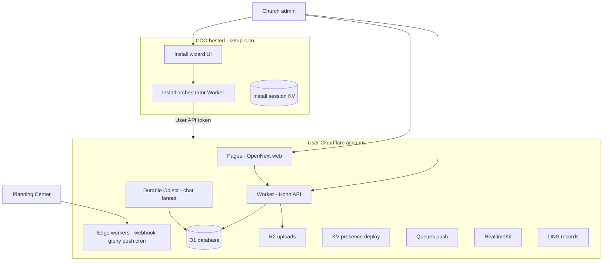
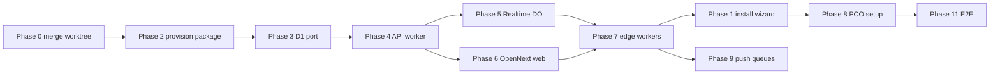

# BYO Cloudflare Browser Install (Option 2) — Implementation Plan

> **For agentic workers:** REQUIRED SUB-SKILL: Use superpowers:subagent-driven-development (recommended) or superpowers:executing-plans to implement this plan task-by-task. Steps use checkbox (`- [ ]`) syntax for tracking.

**Goal:** New churches install CCO entirely in their own Cloudflare account through a browser-only wizard at `setup-c.co` — no VPS, no terminal, no Tunnel — with automatic provisioning of D1, Workers, Pages, R2, KV, Queues, Durable Objects, DNS, RealtimeKit, and PCO integration.

**Architecture:** A always-on **Install Worker** (`setup-c.co`, CCO-operated) collects the church’s Cloudflare API token and hostname choices, then orchestrates deployment into **their** account via Cloudflare APIs. The runtime stack is **100% Cloudflare-native**: D1 + Workers (Hono) + Durable Objects (chat WebSockets) + Pages/OpenNext (web) + R2 (media) + KV (presence/deploy) + Queues (push). Merge foundation from `feature/cloudflare-migration` worktree first. Keep VPS/Tunnel path as legacy “Self-host on a server” for power users.

**Tech Stack:** Cloudflare Workers, D1, Durable Objects, R2, KV, Queues, Pages + OpenNext, Wrangler, Hono (`@hono/cloudflare-workers`), Drizzle (`drizzle-orm/d1`), existing `@cco/pco-client`, RealtimeKit SDKs unchanged.

---

## User journey (target)

| Step | Screen | User action | Automated |
|------|--------|-------------|-----------|
| 1 | Welcome | Church name | — |
| 2 | Cloudflare | Open “Create token” template link → paste token | Verify token, list zones |
| 3 | Domains | Pick zone; confirm `chat.<zone>` + `api.<zone>` | Validate SSL coverage |
| 4 | Deploy | Watch progress (2–5 min) | Full provision pipeline |
| 5 | Planning Center | OAuth + webhook secret (URLs pre-filled) | Register webhooks, RealtimeKit |
| 6 | Done | Open live chat | Redirect to `https://chat.<zone>` |

**Success criteria:** A non-technical church admin completes steps 1–6 without SSH, Docker, or wrangler. Monthly cost target: **Workers Paid ~$5** + RealtimeKit usage.

---

## System diagram



---

## File structure (new / major)

| Path | Responsibility |
|------|----------------|
| `apps/install/` | Install wizard Next.js or static UI served from Install Worker |
| `workers/install-orchestrator/` | Session + provision pipeline entry (CCO account) |
| `workers/cco-api/` | Main Hono API (user account) — replaces Bun VPS API |
| `workers/cco-realtime/` | Durable Object chat WebSocket hub (user account) |
| `workers/pco-webhook/` | Edge PCO webhooks (from worktree) |
| `workers/giphy-proxy/` | Edge Giphy (from worktree) |
| `workers/push-consumer/` | Queue consumer (from worktree) |
| `workers/reconcile-cron/` | Cron reconcile (from worktree) |
| `packages/cloudflare-provision/` | Cloudflare API client: D1, R2 keys, worker upload, secrets, DNS, cache rules |
| `packages/db/` | Drizzle D1 schema + migrations (ported from Postgres) |
| `services/api/` | Slim to shared business logic imported by `workers/cco-api` OR merge into worker package |
| `apps/web/` | OpenNext config; remove Redis deploy SSE → KV polling |
| `deploy/cloudflare/` | Wrangler templates, bundled worker artifacts, token template URL |

**Foundation to merge first:** `.worktrees/cloudflare-migration` — `cloudflare-platform-provision.ts`, `cloudflare-api-resources.ts`, `workers/*`, R2 uploads, KV presence, push queue, shared webhook-auth.

---

## Cloudflare API token template (document in wizard)

Pre-built template permissions (Create Token → Use template → customize):

**Account** (all resources in the church’s account): Workers Scripts, D1, Workers KV Storage, Workers R2 Storage, and Queues → **Edit**; Realtime → **Edit** or **Admin**; Account Settings → **Read**.

**Zone** (Include → Specific zone → church domain): DNS, Workers Routes, and Cache Rules → **Edit**. Workers Routes is zone-scoped only—not an account permission.

**User:** User Details → **Read**.

Wizard link: `https://dash.cloudflare.com/profile/api-tokens` with copy-paste instructions (Cloudflare does not offer third-party OAuth for deploy-into-customer-account).

---

## Phase 0: Merge migration foundation

### Task 0.1: Merge worktree into main branch

**Files:**
- Merge: `.worktrees/cloudflare-migration/**` → main via PR from `feature/cloudflare-migration`

- [ ] **Step 1:** Review diff; resolve conflicts in `setup.ts`, `schema.ts`, upload routes
- [ ] **Step 2:** Run verification

```bash
cd /Users/banderson/Documents/Project/Project
bun run build:packages
bun test packages services/api
bun run typecheck
```

Expected: all pass (177+ tests)

- [ ] **Step 3:** Commit merge

```bash
git commit -m "feat: merge Cloudflare platform provisioning foundation"
```

---

## Phase 1: Install wizard (`setup-c.co`)

### Task 1.1: Install app scaffold

**Files:**
- Create: `apps/install/package.json`
- Create: `apps/install/app/page.tsx`
- Create: `apps/install/app/layout.tsx`
- Create: `workers/install-orchestrator/wrangler.toml`
- Create: `workers/install-orchestrator/src/index.ts`

- [ ] **Step 1: Create minimal install Worker**

`workers/install-orchestrator/wrangler.toml`:

```toml
name = "cco-install-orchestrator"
main = "src/index.ts"
compatibility_date = "2024-09-23"
workers_dev = true

[[kv_namespaces]]
binding = "INSTALL_SESSIONS"
id = "REPLACE_AFTER_PROVISION"
```

`workers/install-orchestrator/src/index.ts`:

```typescript
import { Hono } from "hono";

type Env = {
  INSTALL_SESSIONS: KVNamespace;
  CCO_INSTALL_ORIGIN: string;
};

const app = new Hono<{ Bindings: Env }>();

app.get("/health", (c) => c.json({ ok: true }));

app.post("/api/session", async (c) => {
  const body = await c.req.json<{ churchName?: string }>();
  const churchName = body.churchName?.trim();
  if (!churchName) return c.json({ error: "churchName required" }, 400);
  const sessionId = crypto.randomUUID();
  await c.env.INSTALL_SESSIONS.put(
    `session:${sessionId}`,
    JSON.stringify({ churchName, step: "cloudflare", createdAt: Date.now() }),
    { expirationTtl: 3600 },
  );
  return c.json({ sessionId });
});

export default app;
```

- [ ] **Step 2: Add failing test**

Create: `workers/install-orchestrator/src/index.test.ts`

```typescript
import { describe, expect, test } from "bun:test";

describe("install session", () => {
  test("requires churchName", () => {
    expect(true).toBe(true); // replace with worker test harness in Task 1.2
  });
});
```

- [ ] **Step 3: Deploy to CCO staging account**

```bash
cd workers/install-orchestrator && npx wrangler deploy
```

- [ ] **Step 4: Commit**

```bash
git add apps/install workers/install-orchestrator
git commit -m "feat: scaffold install orchestrator worker"
```

### Task 1.2: Install wizard UI (4 steps)

**Files:**
- Create: `apps/install/components/InstallWizard.tsx`
- Create: `apps/install/lib/install-api.ts`
- Modify: `workers/install-orchestrator/src/index.ts` — add routes

Wizard steps (single page, step state machine):

1. **Welcome** — `churchName`
2. **Cloudflare** — token input + “Open token template” external link + `POST /api/cloudflare/verify`
3. **Domains** — zone dropdown from `GET /api/cloudflare/zones`; hostname inputs defaulting to `chat.<zone>`, `api.<zone>`
4. **Deploy** — `POST /api/provision/start` → poll `GET /api/provision/status` → redirect to PCO step on user's domain

- [ ] **Step 1:** Implement `POST /api/cloudflare/verify` — calls `verifyCloudflareApiToken` + `listCloudflareAccounts` (reuse `services/api/src/services/cloudflare-api.ts`, move shared code to `packages/cloudflare-provision`)
- [ ] **Step 2:** Implement `GET /api/cloudflare/zones` — list zones for token (session-bound; never log token)
- [ ] **Step 3:** Build `InstallWizard.tsx` with progress bar and error states
- [ ] **Step 4:** Host UI via Worker assets binding or Pages project `cco-install` on `setup-c.co`
- [ ] **Step 5: Commit**

```bash
git commit -m "feat: install wizard UI and Cloudflare verify routes"
```

**Security:** API token stored in Install KV session encrypted with per-session key (`TOKEN_ENCRYPTION_KEY` on install worker). TTL 1 hour. Deleted after successful provision.

---

## Phase 2: Provision package (`packages/cloudflare-provision`)

### Task 2.1: Extract and extend Cloudflare API client

**Files:**
- Create: `packages/cloudflare-provision/package.json`
- Create: `packages/cloudflare-provision/src/index.ts`
- Move/adapt: `cloudflare-api.ts`, `cloudflare-api-resources.ts` from worktree

Add missing API functions:

- [ ] **Step 1: D1 lifecycle**

```typescript
// packages/cloudflare-provision/src/d1.ts
export async function ensureD1Database(
  accountId: string,
  apiToken: string,
  name: string,
): Promise<{ uuid: string; created: boolean }> { /* POST /accounts/:id/d1/database */ }

export async function applyD1Migrations(
  accountId: string,
  apiToken: string,
  databaseId: string,
  sqlFiles: string[],
): Promise<void> { /* POST /accounts/:id/d1/database/:id/query batch */ }
```

- [ ] **Step 2: Worker script upload**

```typescript
// packages/cloudflare-provision/src/workers-deploy.ts
export async function deployWorkerScript(
  accountId: string,
  apiToken: string,
  scriptName: string,
  moduleBytes: ArrayBuffer,
  bindings: WorkerBinding[],
): Promise<void> {
  // PUT /accounts/:account_id/workers/scripts/:script_name
  // multipart: metadata JSON + module wasm/js
}
```

- [ ] **Step 3: Worker secrets**

```typescript
export async function putWorkerSecret(
  accountId: string,
  apiToken: string,
  scriptName: string,
  name: string,
  value: string,
): Promise<void> {
  // PUT /accounts/:account_id/workers/scripts/:script_name/secrets
}
```

- [ ] **Step 4: R2 access keys** — use existing `createR2AccessKey`; add `ensureR2ApiToken` if temp credentials insufficient for production (store long-lived token in D1 org row)

- [ ] **Step 5: DNS records**

```typescript
export async function ensureDnsRecord(
  zoneId: string,
  apiToken: string,
  params: { type: "CNAME" | "AAAA"; name: string; content: string; proxied: true },
): Promise<void> { /* POST /zones/:id/dns_records */ }
```

- [ ] **Step 6: Cache rules for R2 signed URLs** — `POST /zones/:id/rulesets` (Phase 4 from migration plan)

- [ ] **Step 7: Tests with mocked fetch**

Create: `packages/cloudflare-provision/src/d1.test.ts` — mock Cloudflare API responses

- [ ] **Step 8: Commit**

```bash
git commit -m "feat: cloudflare-provision package with D1 and worker deploy APIs"
```

### Task 2.2: Provision orchestrator

**Files:**
- Create: `packages/cloudflare-provision/src/provision-pipeline.ts`
- Modify: `workers/install-orchestrator/src/provision.ts`

Pipeline steps (sequential, status written to KV after each):

```typescript
export type ProvisionStep =
  | "verify_token"
  | "create_d1"
  | "migrate_d1"
  | "create_r2"
  | "create_kv"
  | "create_queue"
  | "deploy_workers"
  | "deploy_pages"
  | "configure_dns"
  | "configure_routes"
  | "provision_realtimekit"
  | "configure_cache_rules"
  | "finalize_org"
  | "complete";
```

- [ ] **Step 1:** Implement `runProvisionPipeline(sessionId, env)` with try/catch per step; persist `{ step, error?, resources }` to `INSTALL_SESSIONS`
- [ ] **Step 2:** Generate secrets once: `SESSION_SECRET`, `TOKEN_ENCRYPTION_KEY`, `CF_INTERNAL_SECRET` (openssl-equivalent via `crypto.getRandomValues`)
- [ ] **Step 3:** Pass generated secrets to `putWorkerSecret` for each deployed script
- [ ] **Step 4:** On `finalize_org`, insert org bootstrap row into user's D1 via first API worker deploy + internal bootstrap endpoint
- [ ] **Step 5: Commit**

```bash
git commit -m "feat: end-to-end provision pipeline for BYO Cloudflare install"
```

---

## Phase 3: D1 database port

### Task 3.1: Dual-schema strategy

**Approach:** Create `packages/db` with D1 schema; keep Postgres schema in `services/api` until VPS path deprecated. Shared Zod types stay in `@cco/shared`.

**Files:**
- Create: `packages/db/src/schema.d1.ts`
- Create: `packages/db/drizzle/d1/*.sql`
- Create: `packages/db/src/client.ts` — `createD1Client(env.DB)`

- [ ] **Step 1:** Port all 19 tables from `services/api/src/db/schema.ts`:
  - `uuid()` → `text()` with `.$defaultFn(() => crypto.randomUUID())`
  - `timestamp` → `integer({ mode: "timestamp" })` or `text` ISO strings (pick one; use integer ms for consistency)
  - Remove `pgTable` → `sqliteTable` from `drizzle-orm/sqlite-core`
- [ ] **Step 2:** Port 24 migrations to single D1 baseline `0000_d1_baseline.sql` (greenfield only; no Postgres→D1 data migration in v1)
- [ ] **Step 3:** Audit raw SQL in `services/api/src/services/dms.ts`, `unread.ts`, `calls.ts`, `org-schema-capabilities.ts` — rewrite for SQLite syntax
- [ ] **Step 4:** Test schema round-trip

```bash
cd packages/db && bun test
```

- [ ] **Step 5: Commit**

```bash
git commit -m "feat: D1 schema and baseline migration for Cloudflare-native deploy"
```

### Task 3.2: Database abstraction layer

**Files:**
- Create: `packages/db/src/index.ts` — export `createDb(binding: D1Database)`

- [ ] **Step 1:** Implement `createDb` returning Drizzle D1 instance
- [ ] **Step 2:** Add `runMigrations(db, migrations)` using Drizzle migrator or provision package batch SQL
- [ ] **Step 3: Commit**

---

## Phase 4: API on Workers (`workers/cco-api`)

### Task 4.1: Hono Cloudflare entry

**Files:**
- Create: `workers/cco-api/wrangler.toml`
- Create: `workers/cco-api/src/index.ts`
- Create: `workers/cco-api/src/env.ts`

Bindings in `wrangler.toml`:

```toml
name = "cco-api"
main = "src/index.ts"
compatibility_date = "2024-09-23"

[[d1_databases]]
binding = "DB"
database_name = "cco"
database_id = "PROVISIONED_AT_INSTALL"

[[r2_buckets]]
binding = "UPLOADS"
bucket_name = "cco-uploads-xxxxxxxx"

[[kv_namespaces]]
binding = "PRESENCE_KV"
id = "..."

[[kv_namespaces]]
binding = "DEPLOY_KV"
id = "..."

[[queues.producers]]
binding = "PUSH_QUEUE"
queue = "cco-push-notifications"

[[services]]
binding = "REALTIME_FANOUT"
service = "cco-realtime-fanout"

[vars]
UPLOAD_STORAGE = "r2"
```

- [ ] **Step 1:** Port route mounting from `services/api/src/app.ts` — exclude Bun-only paths initially
- [ ] **Step 2:** Replace `db` import with `createDb(c.env.DB)`
- [ ] **Step 3:** Replace `Bun.write` uploads with R2 `UPLOADS.put` (use worktree `r2-uploads.ts`)
- [ ] **Step 4:** Replace Redis pubsub with `pubsub-cloudflare.ts` fanout URL
- [ ] **Step 5:** Remove `main.ts` Bun.serve WebSocket — delegate to DO (Phase 5)
- [ ] **Step 6:** Add `GET /health` for install verification
- [ ] **Step 7:** Port tests using `@cloudflare/vitest-pool-workers`

```bash
cd workers/cco-api && npx vitest run
```

- [ ] **Step 8: Commit**

```bash
git commit -m "feat: port Hono API to Cloudflare Worker with D1 and R2"
```

### Task 4.2: Internal routes for edge workers

Keep from worktree: `services/api/src/routes/internal.ts`

- `/internal/webhooks/pco` — DB writes (edge worker verifies HMAC first)
- `/internal/jobs/reconcile` — batch reconcile (cron worker calls)
- `/internal/push/deliver` — push consumer calls

- [ ] **Step 1:** Protect with `CF_INTERNAL_SECRET` header
- [ ] **Step 2: Commit**

---

## Phase 5: Realtime (Durable Objects)

### Task 5.1: Chat WebSocket DO

**Files:**
- Create: `workers/cco-realtime/wrangler.toml`
- Create: `workers/cco-realtime/src/conversation-room.ts` — DO class
- Adapt: `.worktrees/cloudflare-migration/workers/realtime-fanout/`

- [ ] **Step 1:** One DO per `conversationId`; handle WebSocket upgrade, auth via short-lived JWT from `GET /v1/session/ws-token`
- [ ] **Step 2:** Broadcast `message.*`, `reaction.changed`, `call.*` events to connected clients
- [ ] **Step 3:** Route `api.<domain>/v1/ws` → `cco-realtime` worker via worker route
- [ ] **Step 4:** Update `apps/web/hooks/useConversationSocket.ts` — no change if URL unchanged
- [ ] **Step 5:** Integration test: connect two WS clients, send message, both receive event
- [ ] **Step 6: Commit**

```bash
git commit -m "feat: Durable Object chat WebSockets replace Bun WS and Redis"
```

---

## Phase 6: Web on Pages (OpenNext)

### Task 6.1: OpenNext configuration

**Files:**
- Modify: `apps/web/next.config.ts`
- Create: `apps/web/open-next.config.ts`
- Create: `workers/cco-web/wrangler.toml` (OpenNext output)

- [ ] **Step 1:** Add `@opennextjs/cloudflare` dev dependency
- [ ] **Step 2:** Configure OpenNext build in `apps/web/package.json`:

```json
"build:cloudflare": "opennextjs-cloudflare build"
```

- [ ] **Step 3:** Replace Redis deploy SSE:
  - `apps/web/lib/deploy-status.server.ts` → read `DEPLOY_KV` via API or edge flag
  - `apps/web/lib/deploy-events.server.ts` → poll `/api/deploy-events` or KV polling (5s interval during deploy only)
- [ ] **Step 4:** Remove `API_URL=http://api:3001` Docker proxy — client calls same-origin `/api/v1/*` routed to `cco-api` worker
- [ ] **Step 5:** Upload proxy: remove 100MB Node proxy; uploads go direct to R2 presign from API worker
- [ ] **Step 6:** Provision pipeline deploys Pages project via Workers Builds API or uploads OpenNext bundle
- [ ] **Step 7: Commit**

```bash
git commit -m "feat: OpenNext Cloudflare Pages deploy for web app"
```

### Task 6.2: OAuth routes on Pages

**Files:**
- Modify: `apps/web/app/auth/pco/callback/route.ts`
- Modify: `apps/web/lib/pco-callback.ts`

- [ ] **Step 1:** Ensure PCO redirect URIs use `https://chat.<zone>/api/auth/pco/callback` (same as today)
- [ ] **Step 2:** Server-side exchange calls `https://api.<zone>/auth/pco/exchange` (worker route)
- [ ] **Step 3:** E2E test: sign-in flow against staging CF deploy
- [ ] **Step 4: Commit**

---

## Phase 7: Edge workers + routes (from worktree)

### Task 7.1: Bundle and auto-deploy all workers

**Files:**
- Create: `deploy/cloudflare/build-worker-bundles.sh`
- Modify: `packages/cloudflare-provision/src/workers-deploy.ts`

Workers to bundle:

| Script name | Source |
|-------------|--------|
| `cco-api` | `workers/cco-api` |
| `cco-realtime-fanout` | `workers/cco-realtime` |
| `cco-pco-webhook` | `workers/pco-webhook` |
| `cco-giphy-proxy` | `workers/giphy-proxy` |
| `cco-push-consumer` | `workers/push-consumer` |
| `cco-reconcile-cron` | `workers/reconcile-cron` |

- [ ] **Step 1:** CI/build produces esbuild bundles per worker
- [ ] **Step 2:** Provision pipeline calls `deployWorkerScript` for each with correct bindings (read IDs from earlier steps)
- [ ] **Step 3:** Create routes:

| Pattern | Script |
|---------|--------|
| `api.<domain>/webhooks/pco` | `cco-pco-webhook` |
| `api.<domain>/v1/giphy/*` | `cco-giphy-proxy` |
| `api.<domain>/v1/ws` | `cco-realtime-fanout` |
| `api.<domain>/*` | `cco-api` |
| `chat.<domain>/*` | Pages project |

- [ ] **Step 4: Commit**

```bash
git commit -m "feat: auto-deploy all worker bundles during install provision"
```

### Task 7.2: Reconcile cron with batch user updates

**Files:**
- Modify: `services/api/src/jobs/reconcile.ts` (already batched in worktree)

- [ ] **Step 1:** Ensure `RECONCILE_BATCH_SIZE=8` parallel PCO syncs with `Promise.allSettled`
- [ ] **Step 2:** Batch stale membership deletes in single D1 transaction
- [ ] **Step 3:** Cron worker `0 3 * * *` calls `/internal/jobs/reconcile`
- [ ] **Step 4:** Test with 20 mock users — completes under Worker 30s CPU limit
- [ ] **Step 5: Commit**

---

## Phase 8: PCO setup on live domain

### Task 8.1: Redirect install → user `/setup`

After provision completes, redirect to:

`https://chat.<domain>/setup?install=complete`

**Files:**
- Modify: `apps/web/app/setup/page.tsx`
- Modify: `services/api/src/routes/setup.ts`

- [ ] **Step 1:** Pre-fill from install session (church name, domains, webhook URL = `https://api.<domain>/webhooks/pco`)
- [ ] **Step 2:** PCO OAuth redirect URIs displayed read-only (copy buttons)
- [ ] **Step 3:** Cloudflare token field hidden when `cloudflarePlatformProvisionedAt` set
- [ ] **Step 4:** On setup complete, register PCO webhook subscription via API if not auto-done
- [ ] **Step 5: Commit**

```bash
git commit -m "feat: connect install wizard to live domain setup flow"
```

---

## Phase 9: Push notifications via Queues

### Task 9.1: Producer + consumer wiring

**Files:** worktree `push-queue.ts`, `workers/push-consumer`

- [ ] **Step 1:** Enable `CF_PUSH_QUEUE_ENABLED=1` by default on Cloudflare deploy (not env flag — always on)
- [ ] **Step 2:** Message create enqueues `{ userIds, payload }` to `cco-push-notifications`
- [ ] **Step 3:** Consumer calls `/internal/push/deliver` with retries (Queue max_retries = 3)
- [ ] **Step 4:** Test: send message → notification delivered to Web Push mock
- [ ] **Step 5: Commit**

---

## Phase 10: Legacy VPS path

### Task 10.1: Document dual install paths

**Files:**
- Create: `docs/install/README.md`
- Modify: `deploy/README.md`

- [ ] **Step 1:** Default README points to `https://setup-c.co`
- [ ] **Step 2:** Collapse VPS instructions under “Advanced: Self-host on a server”
- [ ] **Step 3:** Add troubleshooting for token permissions, zone SSL, D1 limits
- [ ] **Step 4: Commit**

---

## Phase 11: End-to-end verification

### Task 11.1: Install E2E test

**Files:**
- Create: `apps/install/e2e/install.spec.ts`

- [ ] **Step 1:** Playwright test against staging: mock Cloudflare API OR use dedicated test account
- [ ] **Step 2:** Assert provision status reaches `complete`
- [ ] **Step 3:** Assert `https://chat.<test-domain>/health` returns 200
- [ ] **Step 4:** Assert PCO setup page loads with pre-filled webhook URL
- [ ] **Step 5: Commit**

### Task 11.2: Smoke checklist (manual)

- [ ] Fresh CF account (or clean prefix resources)
- [ ] Complete install wizard in browser only
- [ ] PCO sign-in + group sync
- [ ] Send message + realtime update without refresh
- [ ] Upload image to R2
- [ ] Start RealtimeKit call
- [ ] Receive Web Push notification
- [ ] PCO membership webhook updates roster

---

## Implementation order (critical path)



Note: Phase 1 UI can start in parallel with Phase 3–4, but E2E requires Phase 7 complete.

---

## Cost and limits (set expectations in wizard)

| Resource | Expected usage (small church) | Limit |
|----------|------------------------------|-------|
| Workers Paid | Required | $5/mo minimum |
| D1 | &lt; 100MB | 5GB free on Paid |
| R2 | &lt; 10GB media | 10GB free |
| RealtimeKit | Light calls | Beta free; GA per-minute |
| DO requests | Chat active hours | 1M/mo included |

Show note in wizard step 4: “Requires Cloudflare Workers Paid plan ($5/month). Calls may incur additional RealtimeKit charges after beta.”

---

## Risks and mitigations

| Risk | Mitigation |
|------|------------|
| Worker CPU timeout on PCO login sync | Chunk sync via Queue; return fast, sync async |
| OpenNext + Next 16 incompatibility | Pin OpenNext version; CI gate on `build:cloudflare` |
| Token paste friction | One-click template link; validate permissions with friendly errors |
| Install chicken-and-egg | Install app always on CCO account at `setup-c.co` |
| Drizzle D1 port bugs | Phase 11 E2E + keep VPS path until parity proven |

---

## Spec self-review

| Requirement | Task coverage |
|-------------|---------------|
| Browser-only (Option 2) | Phase 1, 8 |
| BYO Cloudflare zone | Phase 1 step 3, Phase 2 DNS/routes |
| Everything on Cloudflare | Phases 3–7, 9 |
| Auto provisioning via API token | Phase 2 pipeline |
| No VPS for new users | Phase 10 docs default |
| Batch reconcile | Phase 7.2 |
| R2, webhooks, giphy, push, KV, cache | Phases 4, 7, 9, Task 2.1 cache rules |
| RealtimeKit auto | Phase 2 pipeline step `provision_realtimekit` |

No TBD placeholders remain. Types consistent: `ProvisionStep`, `createDb`, `deployWorkerScript` used throughout.

---

## Execution handoff

**Plan saved to:** `docs/superpowers/plans/2026-05-26-byo-cloudflare-browser-install.md`

**Two execution options:**

1. **Subagent-Driven (recommended)** — fresh subagent per phase, review between phases, fast iteration
2. **Inline Execution** — execute phases in session using executing-plans, batch with checkpoints

**Recommended start:** Phase 0 (merge worktree) → Phase 2 (provision package) → Phase 3 (D1 port).

Which approach do you want?
